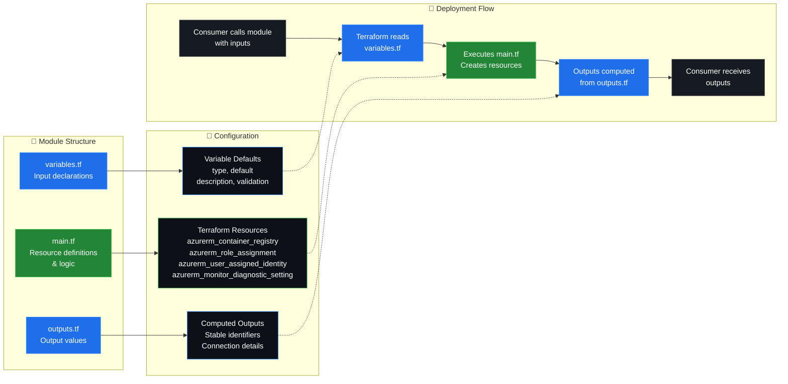
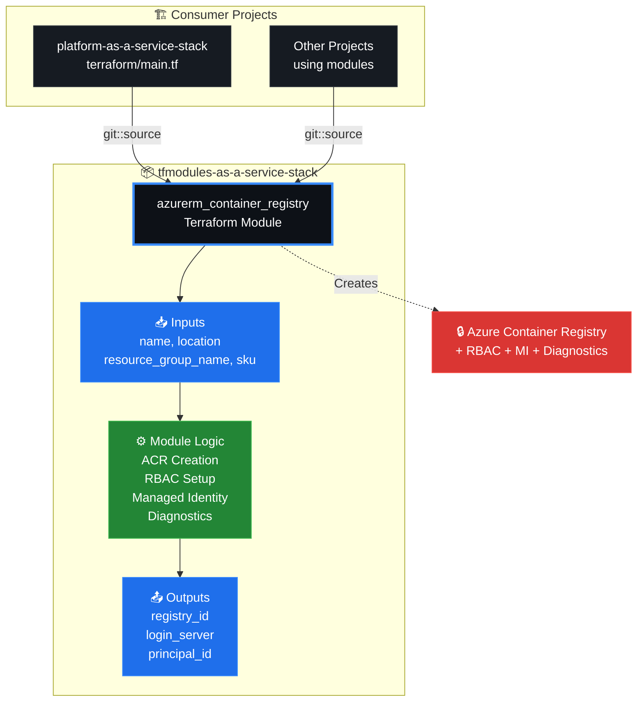
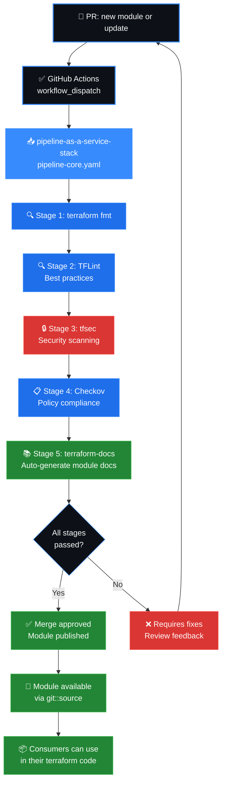

# tfmodules-as-a-service-stack

Repositório de módulos Terraform reutilizáveis para provisionamento de infraestrutura Azure.

## Módulos disponíveis

| Módulo | Descrição | Documentação |
|--------|-----------|--------------|
| [azurerm_container_registry](modules/azurerm_container_registry) | Azure Container Registry (ACR) com RBAC automático, Managed Identity e Diagnostic Settings | — |

## Como usar

Referencie o módulo diretamente via Git:

```hcl
module "container_registry" {
  source = "git::https://github.com/orafaelferreiraa/tfmodules-as-a-service-stack.git//modules/azurerm_container_registry?ref=main"

  name                = "crMyAppEus2a1b2"
  location            = "eastus2"
  resource_group_name = "rg-myapp-eus2"
  sku                 = "Basic"
}
```

> Para detalhes de cada módulo (inputs, outputs, exemplos completos), consulte o README dentro da pasta do módulo.

---

## 🏗️ Arquitetura & Integração

### Estrutura do Módulo Terraform



### Consumo & Integração



### Validação & Release



---

## Estrutura

```
tfmodules-as-a-service-stack/
└── modules/
    └── azurerm_container_registry/
        ├── main.tf
        ├── variables.tf
        └── outputs.tf
```

## Requisitos

| Nome | Versão |
|------|--------|
| Terraform | >= 1.9.0 |
| azurerm | ~> 4.57 |
